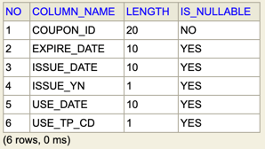
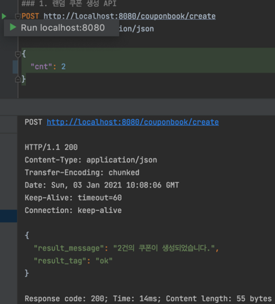

# README.md

## Rest API 기반 쿠폰시스템 개발

### 1. 개발 환경
- Mac OS
- Java 8
- Spring 5.3.2
- Spring Boot2
- JPA
- IntelliJ IDEA Ultimate 2020.3
- H2 DataBase

    
### 2. 개발 순서
1. 개발 툴 설치 및 기본 셋팅
    - H2 DataBase
    - intellij lombok 플러그인 셋팅
    - build.gradle 셋팅
    - Enable annotation 설정
2. 프로젝트 생성
    - Spring Initializr 이용하여 신규 프로젝트 생성
3. DB 모델링
4. Rest API 개발
5. HttpRequest 테스트
6. Test Code 작성


### 2. 프로젝트 구조
- src > main > java > com.ms1.springstart
    - book 
        - CouponBook
        - CouponBookRepository
    - DTO
        - CouponDTO
        - CouponUseType
    - exception
        - ResourceNotFoundException
    - service
        - CouponBookService
    - web 
        - MainController (메인 컨트롤러)
    - CouponBookRequest (Http API 호출 테스트)
    - SpringStartApplication (실행 파일)
- src > main > resources
    - application.yml 
- src > test > java > com.ms1.springstart
    - CouponBookTest (테스트 코드)


### 3. DB 모델링
- Embedded H2 DataBase
    ```sql
    /* 마스터 테이블 */
    SELECT COUPON_ID -- 쿠폰번호
         , ISSUE_YN -- 지급여부(Y/N)
         , ISSUE_DATE -- 지급일자
         , EXPIRE_DATE -- 만료일자
         , USE_TP_CD -- 사용여부(Y/N/C)
         , USE_DATE -- 사용일자
      FROM COUPON_BOOK
     ORDER BY ISSUE_DATE
            , EXPIRE_DATE
            , USE_TP_CD
    ;
    ```
    
    ```sql
    /* 테이블 스키마 */
    SELECT ORDINAL_POSITION AS No -- 번호
         , COLUMN_NAME -- 컬럼명
         , CHARACTER_OCTET_LENGTH AS LENGTH -- 컬럼길이
         , IS_NULLABLE AS IS_NULLABLE -- null허용여부
      FROM INFORMATION_SCHEMA.COLUMNS 
     WHERE TABLE_NAME = 'COUPON_BOOK'
     ORDER BY ORDINAL_POSITION
    ;
    ```
      

- [참고] SpringStartApplication 실행 시, DB Table 삭제 후 생성   
    ```sql
    Hibernate: 
        
        drop table if exists coupon_book CASCADE 
    Hibernate: 
        
        create table coupon_book (
           coupon_id varchar(20) not null,
            expire_date date,
            issue_date date,
            issue_yn varchar(1),
            use_date date,
            use_tp_cd varchar(1),
            primary key (coupon_id)
        )
    ```        

### 4. API 목록
#### [참고] CouponBookRequest.http
1. 랜덤 쿠폰 생성 API
    - 쿠폰번호 : XXXXX-XXXXX-XXXXXXXX
    - 지급여부 : N
    - 사용여부 : N
   ```http request
    POST http://localhost:8080/couponbook/create
    Content-Type: application/json
    
    {
    "cnt": 5
    }
    ```
    ```http request
    {
      "result_message": "5건의 쿠폰이 생성되었습니다.",
      "result_tag": "ok"
    }
    
    Response code: 200; Time: 33ms; Content length: 55 bytes
    ```   

2. 쿠폰 랜덤 지급 API
    - 지급여부 : Y
    - 지급일자 : sysdate
    - 만료일자 : sysdate + 5days
    ```http request
    PUT http://localhost:8080/couponbook/issue
    Content-Type: application/json
    ```
    ```http request
    {
    "result_message": "'WTDXq-U5l9f-5k69wOf8' 쿠폰이 지급되었습니다.",
    "result_tag": "ok"
    }
    
    Response code: 200; Time: 31ms; Content length: 74 bytes
    ```   

3. 사용자에게 지급된 쿠폰 목록 조회
   ```http request
    GET http://localhost:8080/couponbook/list/issue
    Accept: application/json
    ```
    ```http request
    {
    "result_message": [
    "CUNeF-CoXTh-JJdwvEFW",
    "WTDXq-U5l9f-5k69wOf8",
    "kneBR-UHZPn-Lf7yCG0X",
    "r9A0b-KC8fI-ZGhh7sE3"
    ],
    "result_tag": "ok"
    }
    
    Response code: 200; Time: 23ms; Content length: 130 bytes
    ```   

4. 쿠폰 사용 API (재사용 불가)
    - 사용구분코드 : Y (사용)
    - 사용일자 : sysdate
   ```http request
    PUT http://localhost:8080/couponbook/use
    Content-Type: application/json
    
    {
    "coupon_id" : "j9cdL-j50Mo-7Li52Mht"
    }
    ```
    ```http request
    {
      "result_message": "'CUNeF-CoXTh-JJdwvEFW' 쿠폰 사용 처리 되었습니다.",
      "result_tag": "ok"
    }
    
    Response code: 200; Time: 27ms; Content length: 77 bytes
    ```   
    ```http request
    {
      "result_message": "쿠폰을 확인하세요. 번호가 잘못되었거나 이미 사용된 쿠폰입니다.",
      "result_tag": "fail"
    }
    
    Response code: 200; Time: 34ms; Content length: 76 bytes
    ```

5. 쿠폰 사용 취소 API (취소된 쿠폰은 재사용 가능)
    - 사용구분코드 : C (취소)
    - 사용일자(취소일자) : sysdate 
    ```http request
    PUT http://localhost:8080/couponbook/cancel
    Content-Type: application/json
    
    {
      "coupon_id" : "KhfuK-rm1cA-hGjw1yPs"
    }
    ```
   ```http request
    {
    "result_message": "'CUNeF-CoXTh-JJdwvEFW' 쿠폰 사용 취소 되었습니다.",
    "result_tag": "ok"
    }
    
    Response code: 200; Time: 28ms; Content length: 77 bytes
    ```

6. 당일 만료될 쿠폰 목록 조회 API (단, 사용된 쿠폰은 제외)
    ```http request
    GET http://localhost:8080/couponbook/list/expire
    Accept: application/json
    ```   
    ```http request
    {
      "result_message": [
        "CUNeF-CoXTh-JJdwvEFW"
      ],
      "result_tag": "ok"
    }
    
    Response code: 200; Time: 98ms; Content length: 61 bytes
    ```

7. 만료 3일전 아직까지 사용 안된 쿠폰 목록 조회 (오늘을 기준으로 만료일이 지나간 쿠폰은 목록에서 제외)
    ```http request
    GET http://localhost:8080/couponbook/list/expire/notice
    Accept: application/json
    ```
    ```http request
    {
      "result_message": [
        "WTDXq-U5l9f-5k69wOf8 (만료일 : 2021-01-04)",
        "kneBR-UHZPn-Lf7yCG0X (만료일 : 2021-01-05)"
      ],
      "result_tag": "ok"
    }
    ```

### 5. 프로젝트 실행
- src > main > java > com.ms1.springstart > web > SpringStartApplication > 우클릭, "Run SpringStartAppAllication"
    - [참고] 프로젝트 실행 시, 이미 8080 포트가 실행 중인 경우, 아래와 같이 프로세스 종료 후 재실행
    ```shell
    spring-start % lsof -i :8080
    COMMAND   PID     USER   FD   TYPE             DEVICE SIZE/OFF NODE NAME
    java    34622 xxxxxxxx  xxxx  IPv6 xxxxxxxxxxxxxxxxxx      xxx  TCP *:http-alt (LISTEN)
    spring-start % kill -9 34622
    ```
- H2 Console 실행 : 프로젝트 실행 > Chrome > H2-Console Connect
    ```shell
    - URI : localhost:8080/h2-console
    - JDBC URL : jdbc:h2:nen:testdb
    ```
    


### 6. Http Request 테스트
- src > main > java > com.ms1.springstart > web > CouponBookRequest.http 
    - CouponBookRequest.http 소스 오픈, 원하는 API 실행
    -  


### 7. Test Code
- JUnit 사용, Service 및 Repository 테스트